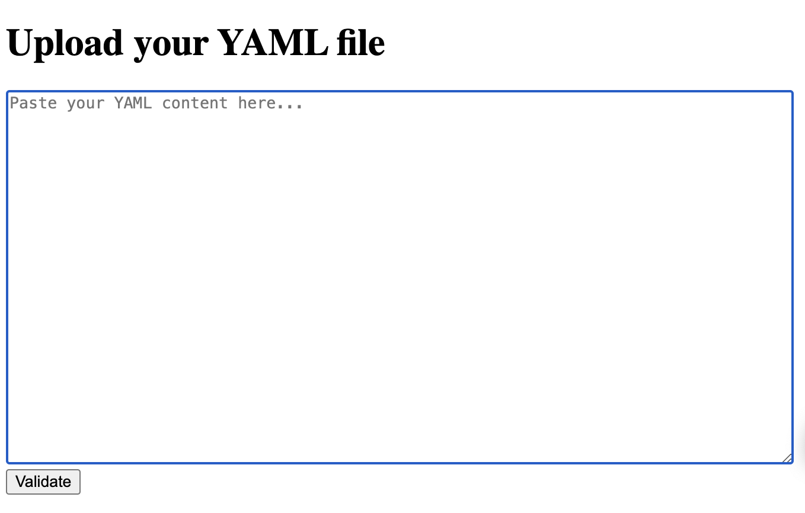

# YAML Alignment Validator Tool

## Overview

The **YAML Alignment Validator Tool** is a Rust-based application that provides a simple and intuitive web browser UI to validate the line alignments of YAML files. This tool ensures that your YAML files are properly aligned, reducing the risk of syntax errors and improving readability.

## Project Structure

```text
src/
├── main.rs
├── handlers.rs
├── models.rs
└── validator.rs
```

## Features

- **Web Browser UI**: User-friendly interface for validating YAML files.  

- **Alignment Validation**: Detects and highlights misaligned lines in YAML files.  
- **Fast and Lightweight**: Built with Rust for high performance and low resource usage.  

## Installation

1. Clone the repository:  
    ```bash
    git clone https://github.com/dinuka-kasun-medis/yaml-alignment-validator.git
    cd yaml-alignment-validator
    ```

2. Build the project:  
    ```bash
    cargo build
    ```

3. Run the application:  
    ```bash
    cargo run
    ```

## Usage

1. Open your web browser and navigate to the provided local URL (e.g., `http://localhost:8080`).  
2. Upload your YAML file using the interface.  
3. Review the validation results and fix any alignment issues.  

## Contributing

Contributions are welcome! Please fork the repository and submit a pull request with your changes.  

## Acknowledgments

- Built with Rust for performance and reliability.  
- Inspired by the need for better YAML validation tools.  
